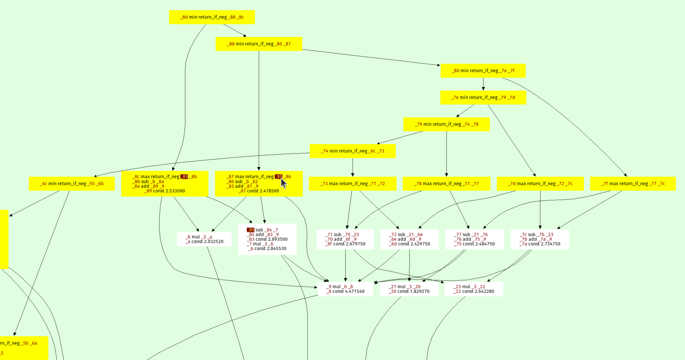

playing around with an rpython version of https://github.com/mkeeter/fidget

Blog post draft below:

# Solving the Prospero Challenge in RPython

Recently I had a lot of fun playing with the [Prospero
Challenge](https://www.mattkeeter.com/projects/prospero/) by [Matt
Keeter](https://www.mattkeeter.com/). The challenge is to render a 1024x1024 of
a quote from The Tempest by Shakespeare. The input is a mathematical formula
with 7866 operations. What made the challenge particularly enticing for me
personally was the fact that the formula is basically a trace in SSA-form – a
linear sequence of operations, where every variable is assinged exactly once.
The challenge is to evaluate the formula as fast as possible. I tried a number
of ideas how to speed up execution and will talk about them in this somewhat
meandering post. Most of it follows Matt's implementation [Fidget](https://github.com/mkeeter/fidget) very
closely. Ther are two points of difference:
- I tried to add more peephole optimizations, but they didn't end up helping
  much.
- I implemented a "demanded information" optimization that removes a lot of
  operations by only keeping the sign of the result. This optimization ended up
  being very useful.

Most of the prototyping in this post was done in RPython, but I later rewrote
the program in C to get better performance.

## Input program

The input program is a sequence of operations, like this:

```
_0 const 2.95
_1 var-x
_2 const 8.13008
_3 mul _1 _2
_4 add _0 _3
_5 const 3.675
_6 add _5 _3
_7 neg _6
_8 max _4 _7
...
```

The first column is the name of the result variable, the second column is the
operation, and the rest are the arguments to the operation. The `var-x` is a
special operation that returns the x-coordinate of the pixel being rendered,
and equivalently for `var-y` the y-coordinate. The sign of the result gives the
color of the pixel, the absolute value is not important.

## Using Quadtrees to evaluate the picture

The approach that Matt describes in his really excellent
[talk](https://www.youtube.com/watch?v=UxGxsGnbyJ4) is to use
[quadtrees](https://en.wikipedia.org/wiki/Quadtree): recursively subdivide the
image into quadrants, and evaluate the formula in each quadrant. For every
quadrant you can simplify the formula by doing a range analysis. At the bottom
of the recursion you either reach a square where the range analysis reveals
that the sign for all pixels is determined, then you can fill in all the pixels
of the quadrant. Or you can evaluate the (now much simpler) formula in the
quadrant by executing it for every pixel.

This is an interesting use case of compiler/optimization techniques because it
requires the optimizer to execute really quickly, since it is an essential part
of the performance of the algorithm.

## Applying the toy optimizer pattern

The first thing I did was to implement a simple interpreter for the SSA-form
input program. The interpreter is a simple register machine, where every
operation is executed in order. The result of the operation is stored into a
list of results, and the next operation is executed. This was the slow baseline
implementation of the interpreter but it's very useful to compare the optimized
versions against.

To implement the quadtree recursion is straightforward. Since the program has
no control flow, I could directly apply the [Toy
Optimizer](https://pypy.org/categories/toy-optimizer.html) approach. The
interval analysis is an [abstract
interpretation](https://pypy.org/posts/2024/08/toy-knownbits.html) of the
operations. The optimizer does a sequential forward pass over the input
program. For every operation, the output interval is computed. The optimizer
also performs optimizations based on the computed intervals, which helps in
reducing the number of operations executed (I'll talk about this further down).

The resulting optimized traces are simply interpreted. Matt talks about also
generating machine code from them, but when I tried to use PyPy's JIT for that
it was simply way too slow at producing machine code.

## Testing soundness of the interval abstract domain

To make sure that my interval computation in the optimizer is correct, I
implemented a hypothesis-based property based test. It checks the abstract
transfer functions of the interval domain for soundness. It does so by
generating random concrete input values for an operation, random intervals that
surround the random concrete values, then performs the concrete operation to
get the concrete output, and checks that the abstract transfer function applied
to the input intervals gives an interval that contains the concrete output.

For example, the random test for the `square` operation would look like this:

```python
from hypothesis import given, strategies, assume
from pyfidget.vm import IntervalFrame, DirectFrame
import math

regular_floats = strategies.floats(allow_nan=False, allow_infinity=False)

def make_range_and_contained_float(a, b, c):
    a, b, c, = sorted([a, b, c])
    return a, b, c

frame = DirectFrame(None)
intervalframe = IntervalFrame(None)

range_and_contained_float = strategies.builds(make_range_and_contained_float, regular_floats, regular_floats, regular_floats)

def contains(res, rmin, rmax):
    if math.isnan(rmin) or math.isnan(rmax):
        return True
    return rmin <= res <= rmax


@given(range_and_contained_float)
def test_square(val):
    a, b, c = val
    rmin, rmax = intervalframe._square(a, c)
    res = frame.square(b)
    assert contains(res, rmin, rmax)
```

This test generates a random float `b`, and two other floats `a` and `c` such
that the interval `[a, c]` contains `b`. The test then checks that the result
of the `square` operation on `b` is contained in the interval `[rmin, rmax]`
returned by the abstract transfer function for the `square` operation.


## Peephole rewrites

The only optimization that Matt does in his implementation is a peephole
optimization rule that removes `min` and `max` operations where the intervals
of the arguments don't overlap. In that case, the optimizer statically can know
which of the arguments will be the result of the operation. I implemented this
peephole optimization in my implementation as well, but I also added a few more
peephole optimizations that I thought would be useful.

However, it turns out that all my attempts at adding other peephole
optimization rules were not very useful. Most rules never fired, and the ones
that did only had a small effect on the performance of the program. The only
peephole optimization that I found to be useful was the one that Matt describes
in his talk. Matt's `min`/`max` optimization were 96% of all rewrites that my
peephole optimizer applied for the `prospero.vm` input. The remaining 4% of
rewrites were (the percentages are of that 4%):

```
--x => x                          4.65%
(-x)**2 => x ** 2                 0.99%
min(x, x) => x                   20.86%
min(x, min(x, y)) =>  min(x, y)  52.87%
max(x, x) => x                   16.40%
max(x, max(x, y)) => max(x, y)    4.23%
```

In the end it turned out that having these extra optimization rules made the
total runtime of the system go up. Checking for the rewrites isn't free, and
since they apply so rarely they don't pay for their own cost in terms of
improved performance.

There are some further rules that I tried that never fired at all:

```
a * 0 => 0
a * 1 => a
a * a => a ** 2
a * -1 => -a
a + 0 => a
a - 0 => a
x - x => 0
abs(known positive number x) => x
abs(known negative number x) => -x
abs(-x) => abs(x)
(-x) ** 2 => x ** 2
```

This investigation is clearly way too focused on a single program and should be
re-done with a larger set of example inputs, if this were an actually serious
implementation.

## Demanded Information Optimization

LLVM has an information called 'demanded bits'. It is a backwards analysis that
allows you to determine which bits of a value are actually used in the final
result. This information can then be used in peephole optimizations. For
example, if you have an expression that computes a value, but only the last
byte of that value is used in the final result, you can optimize the expression
to only compute the last byte.

As as example, the is some complicated integer expression on `uint64_t`, but at
the end there is a mask of the result with `0xff`, then the higher bytes don't
affect the result at all, and the operations can be done (maybe more cheaply)
on bytes.

For Fidget, we can observe that for the resulting pixel values, the value of
the result is not used at all, only its sign. This makes it possible to
simplify certain min/max operations further. Here is an example of a program,
toghether with the intervals of the variables:

```
x var-x     # [0.1, 1]
y var-y     # [-1, 1]
out min x y # [-1, 1]
```

This program can be optimized to:

```
y var-y
```

Because that expression has the same sign as the original expression: if `x >
0.1`, for the result of `min(x, y)` to be negative then `y` needs to be negative.

Another, more complex, example is this:

```
x var-x        # [1, 100]
y var-y        # [-10, 10]
z var-z        # [-100, 100]
out min x y    # [-10, 10]
out2 max z out # [-10, 100]
```

Which can be optimized to this:

```
y var-y
z var-z
out max z y
```

This is because the sign of `min(x, y)` is the same as the sign of `y` if `x >
0`, and the sign of `max(z, min(x, y))` is thus the same as the sign of `max(z,
y)`.

To implement this optimization, I do a backwards pass over the program after
the peephole optimization forward pass. For every `min` call I encounter, where
one of the arguments is positive, I can optimize the `min` call away and
replace it with the other argument. For `max` calls I simplify their arguments
recursively.

In my experiment, this optimization lets me remove 25% of all operations in
prospero, at the various levels of my octree. I'll briefly look at performance
results further down.

## Further ideas about the demanded sign simplification

There is another idea how to short-circuit the evaluation of expressions that I
tried briefly but didn't pursue to the end. Let's go back to the first example
of the previous subsection, but with different intervals:

```
x var-x     # [-1, 1]
y var-y     # [-1, 1]
out min x y # [-1, 1]
```

Now we can't use the "demanded sign" trick in the optimizer, because neither
`x` nor `y` are known positive. However, during *execution* of the program, if
`x` turns out to be negative we can end the execution of this trace
immediately, since we know that the result must be negative.

So I experimented with adding `return_early_if_neg` flags to all operations
with this property. The interpreter then checks whether the flag is set on an
operation and if the result is negative, it stops the execution of the program
early.

This looked pretty promising, but it's also a trade-off because the cost of
checking the flag and the value isn't zero. I implemented this in the RPython
version, but didn't end up porting it to C, because it interferes with SIMD.

## Dead code elimination

Matt performs dead code elimination in his implementation by doing a single
backwards pass over the program. This is a very simple and effective
optimization, and I implemented it in my implementation as well. The dead code
elimination pass is very simple: It starts by marking the result operation as
used. Then it goes backwards over the program. If the current operation is
used, its arguments are marked as used as well. Afterwards, all the operations
that are not marked as used are removed from the program. The PyPy JIT actually
performs dead code elimination on traces in exactly the same way (and I don't
think we ever explained how this works on the blog), so I thought it was worth
mentioning.

Matt also performs register allocation as part of the backwards pass, but I
didn't implement it because I wasn't too interested in that aspect.

## Random testing of the optimizer

To make sure I didn't break anything in the optimizer, I implemented a random
test that generates random input programs and checks that the output of the
optimizer is equivalent to the input program. The test generates random
operations, random intervals for the operations and a random input value within
that interval. It then runs the optimizer on the input program and checks that
the output program has the same result as the input program. This is again
implemented with `hypothesis`.


## Vizualizing programs

It's actually surprisingly annoying to visualize `prospero.vm` well, because
it's quite a bit too large to just feed it into Graphviz. I made the problem
slightly easier by grouping several operations together, where only the first
operation in a group is used as the argument for more than one operation
further in the program. This made it slightly more managable for Graphviz. But
it still wasn't a big enough improvement to be able to visualize all of
`prospero.vm` in its unoptimized form at the top of the octree.

Here's a visualization of the optimized `prospero.vm` at one of the octree
levels:



The result is on top, every node points to its arguments. The `min` and `max`
operations form a kind of "spine" of the expression tree, because they are
unions and intersection in the constructive solid geometry sense.

## C implementation

To achieve even faster performance, I decided to rewrite the implementation in
C. While RPython is great for prototyping, it can be challenging to control
low-level aspects of the code. The rewrite in C allowed me to experiment with
several techniques I had been curious about:

- [`musttail` optimization](https://blog.reverberate.org/2021/04/21/musttail-efficient-interpreters.html) for the interpreter.
- SIMD (Single Instruction, Multiple Data): Using Clang's
  [`ext_vector_type`](https://clang.llvm.org/docs/LanguageExtensions.html#vectors-and-extended-vectors), I process eight pixels at once using AVX (or some other
  SIMD magic that I don't properly understand).
- Efficient struct packing: I packed the operations struct into just 8
  bytes by limiting the maximum number of operations to 65,536, with the idea
  of making the optimizer faster.

I didn't rigorously study the performance impact of each of these techniques
individually, so it's possible that some of them might not have contributed
significantly. However, the rewrite was a fun exercise for me to explore these
techniques.

## Testing the C implementation

To test the C implementation, I used the same random testing approach as in the
RPython version. I generated random input programs as strings in Python and
checked that the output of the C implementation was equivalent to the output of
the RPython implementation. This helped ensure that the C implementation was
correct and didn't introduce any bugs. It was surprisingly tricky to get this
right, for reasons that I didn't expect. At lot of them are related to the fact
that in C I used `float` and Python uses `double` for its (Python) `float`
type. This made the random tester find weird floating point corner cases where
rounding behaviour between the widths was different.

I solved those by using `double` in C when running the random tests by means of
an `IFDEF`.

It's super fun to watch the random program generator produce random images, here are a few:


## Performance

Some very rough performance results on my laptop (an AMD Ryzen 7 PRO 7840U with
32 GiB RAM running Ubuntu 24.04), comparing the RPython version, the C version
(with and without demanded bits), and Fidget (in `vm` mode, its JIT made things
worse for me), both for 1024x1024 and 4096x4096 images:

| Implementation       | 1024x1024 | 4096x4096 |
|----------------------|-----------|-----------|
| RPython              | 26.8ms    | 75.0ms    |
| C (no demanded bits) | 24.5ms    | 45.0ms    |
| C (demanded bits)    | 18.0ms    | 37.0ms    |
| Fidget               | 10.8ms    | 57.8ms    |

The demanded bits seem to help quite a bit, which was nice to see.

## Conclusion

That's it! I had lots of fun with the challenge and have a whole bunch of other
ideas I want to try out, but I should actually go back to working on my actual
projects now ;-).
